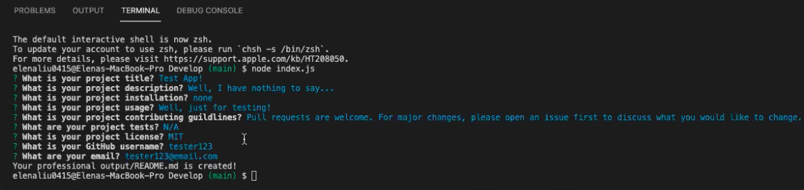
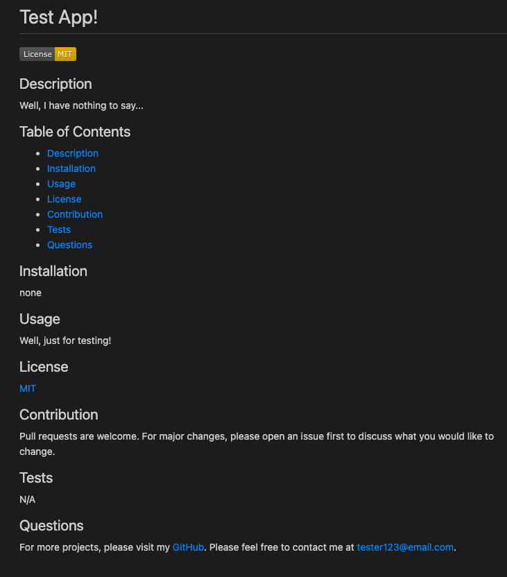

# Professional README Generator 🤓

## Table of Contents

- [Table of Contents](#table-of-contents)
- [Description](#description)
- [Installation](#installation)
- [Screenshot for Demonstration](#screenshot-for-demonstration)
- [Walkthrough Video](#walkthrough-video)
- [Questions](#questions)

## Description 
- When creating an open source project on GitHub, it’s important to have a high-quality README for the app. This should include what the app is for, how to use the app, how to install it, how to report issues, and how to make contributions—this last part increases the likelihood that other developers will contribute to the success of the project. 

- This command-line application allows users to dynamically generates a professional README.md file from the user's input in no time! 

## Installation
- Node.js is required to be installed, in order to run this command-line application. 

## Screenshot for Demonstration

## Walkthrough Video
- [URL for Walkthrough Video](https://drive.google.com/file/d/1VS5p_6nik39G1FMuvTWOIzmyjrZl9Kkf/view?usp=sharing)

## Questions
- For more projects, please visit my [GitHub](https://github.com/elenaliu0415). 
- Please feel free to contact me at elenaliu0415@gmail.com
